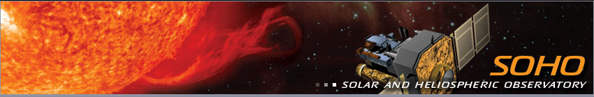
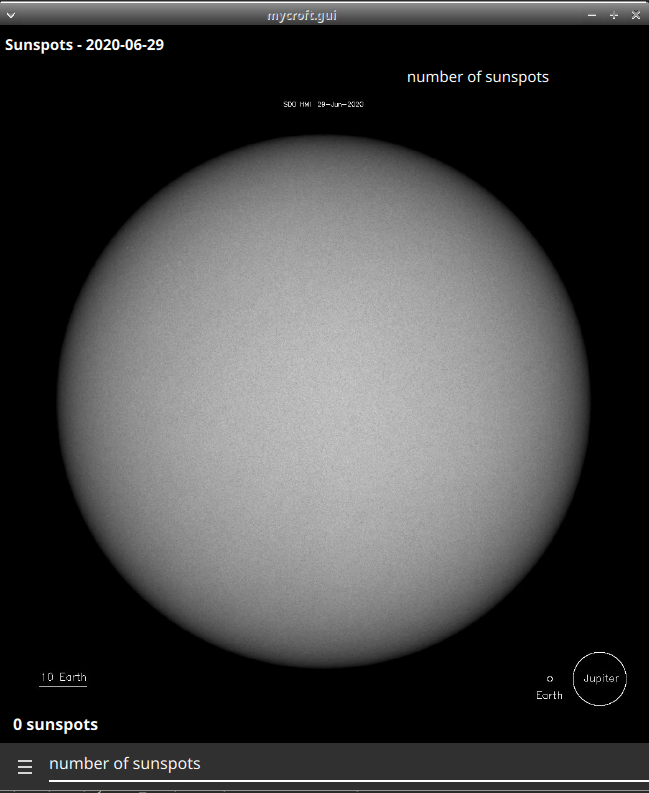

#  Solar and Heliospheric Observatory Skill

## About

Daily sunspot data from [Sunspot Index and Long-term Solar Observations](http://sidc.be/silso/home) and pictures from NASA's [SOlar and Heliospheric Observatory](https://sohowww.nascom.nasa.gov/sunspots/)
  
Can be used as idle screen for the mark2

## Examples
* "whats the number of sunspots"
* "how many sunspots recently"
* "how many sunspots yesterday"
* "how many sunspots 3 days ago"

## TODO
- quick facts
- next/previous intent

## Credits
- JarbasAi
- [SOHO](https://sohowww.nascom.nasa.gov/sunspots/)
- [SILSO](http://sidc.be/silso/home)

## Category
**Information**

## Tags
#nasa #space #sun
