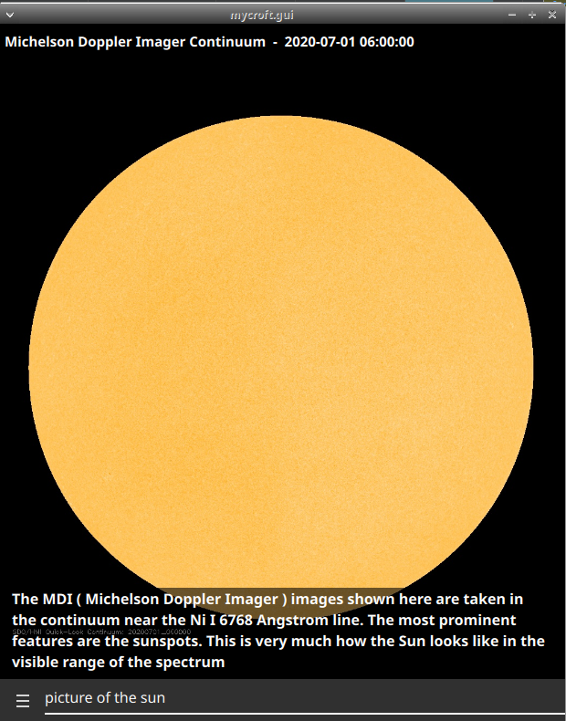
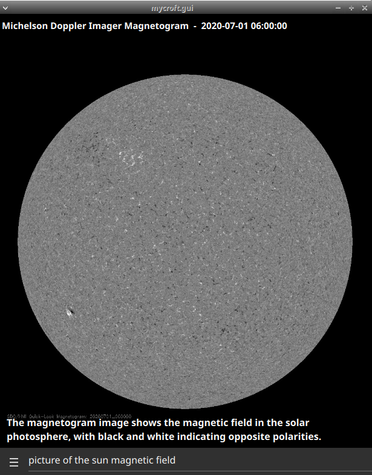

#  Helioviewer Skill

## About

Daily sunspot data from [Sunspot Index and Long-term Solar Observations](http://sidc.be/silso/home) and pictures from NASA's [Solar and Heliospheric Observatory](https://sohowww.nascom.nasa.gov/sunspots/)
  
Can be used as idle screen for the mark2

## Examples
* "Live picture of the sun"
* "whats the number of sunspots"
* "how many sunspots yesterday"
* "how many sunspots 3 days ago"
* "show me a picture of the solar corona"
* "ultraviolet sun picture for 2 million degrees"
* "ultraviolet picture of the heliosphere"
* "show me magnetic field of the sun"
* "animate that"
* "next picture"
* "previous picture"
* "open helioviewer"

## TODO
- quick facts

# Platform support

- :heavy_check_mark: - tested and confirmed working
- :x: - incompatible/non-functional
- :question: - untested
- :construction: - partial support

|     platform    |   status   |  tag  | version | last tested | 
|:---------------:|:----------:|:-----:|:-------:|:-----------:|
|    [Chatterbox](https://hellochatterbox.com)   | :question: |  dev  |         |    never    | 
|     [HolmesV](https://github.com/HelloChatterbox/HolmesV)     | :question: |  dev  |         |    never    | 
|    [LocalHive](https://github.com/JarbasHiveMind/LocalHive)    | :question: |  dev  |         |    never    |  
|  [Mycroft Mark1](https://github.com/MycroftAI/enclosure-mark1)    | :question: |  dev  |         |    never    | 
|  [Mycroft Mark2](https://github.com/MycroftAI/hardware-mycroft-mark-II)    | :question: |  dev  |         |    never    |  
|    [NeonGecko](https://neon.ai)      | :question: |  dev  |         |    never    |   
|       [OVOS](https://github.com/OpenVoiceOS)        | :question: |  dev  |         |    never    |    
|     [Picroft](https://github.com/MycroftAI/enclosure-picroft)       | :question: |  dev  |         |    never    |  
| [Plasma Bigscreen](https://plasma-bigscreen.org/)  | :question: |  dev  |         |    never    |  

- `tag` - link to github release / branch / commit
- `version` - link to release/commit of platform repo where this was tested

## Credits
- JarbasAi
- [HelioViewer](https://helioviewer.org/)
- [SOHO](https://sohowww.nascom.nasa.gov/sunspots/)
- [SILSO](http://sidc.be/silso/home)

## Category
**Information**

## Tags
#nasa #space #sun #helioviewer
